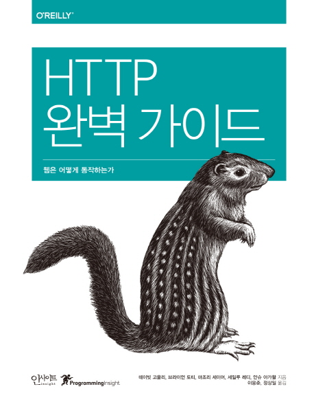
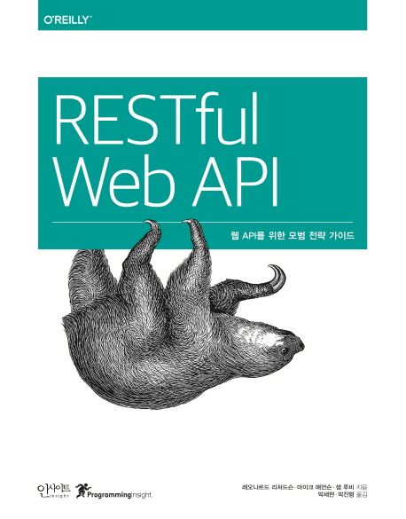

# Mash up 4기 HTTP와 RESTful 스터디

## 원칙
1. 2주간 2장씩 각자 TIL을 씁니다. 
2. 당일날 랜덤으로 2인이 각자 발표, 학습한 내용에 대해서 이야기하기 

## 진행 상황

| 날짜 | 진도 | 발표자 |
|:----:|:---:|:------:|
| 10/28 | HTTP 완벽 가이드 1, 2장   |   |  

## 교재
1. HTTP 완벽 가이드

2. RESTful Web API

## 참고 자료

### HTTP
[HTTP Web Server 실습(JAVA) 강의](https://www.youtube.com/watch?v=qgFVj916nX8&list=PLqaSEyuwXkSqV88SwDxuY56xmj6KsmzRN)

### RESTful
[https://pages.apigee.com/rs/apigee/images/api-design-ebook-2012-03.pdf](http://meetup.toast.com/posts/92)  

[https://www.slideshare.net/JavaCommunityOrg/restful-java](https://www.slideshare.net/JavaCommunityOrg/restful-java)

일관성 있는 웹 서비스 인터페이스 설계를 위한 REST API 디자인 규칙(책)

[https://restful-api-design.readthedocs.io/en/latest/](https://restful-api-design.readthedocs.io/en/latest/)   

[http://jinson.tistory.com/m/190](http://jinson.tistory.com/m/190)  

[https://www.ics.uci.edu/~fielding/pubs/dissertation/top.html](https://www.ics.uci.edu/~fielding/pubs/dissertation/top.html)  
[http://meetup.toast.com/posts/92i](http://meetup.toast.com/posts/92)
